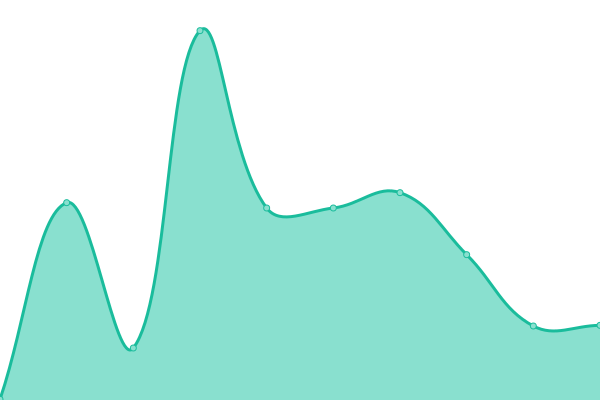
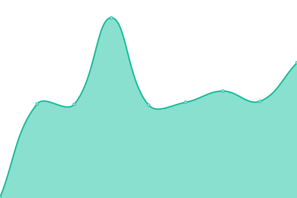

This repository contains the open-source uptime monitor and status page for [Cardano Foundation](https://cardanofoundation.org), powered by [Upptime](https://github.com/upptime/upptime).

With [Upptime](https://upptime.js.org), you can get your own unlimited and free uptime monitor and status page, powered entirely by a GitHub repository. We use [Issues](https://github.com/cardano-foundation/cf-summit-evoting-status/issues) as incident reports, [Actions](https://github.com/cardano-foundation/cf-summit-evoting-status/actions) as uptime monitors, and [Pages](https://status.voting.summit.cardano.org) for the status page.

# [📈 Live Status](https://status.voting.summit.cardano.org): <!--live status--> **🟧 Partial outage**

<!--start: status pages-->
<!-- This summary is generated by Upptime (https://github.com/upptime/upptime) -->
<!-- Do not edit this manually, your changes will be overwritten -->
<!-- prettier-ignore -->
| URL | Status | History | Response Time | Uptime |
| --- | ------ | ------- | ------------- | ------ |
|  [DEV-cip1694.metadata.dev.cf-deployments.org](https://dev.cf-cip1694-preprod.eu-west-1.metadata.dev.cf-deployments.org/) | 🟩 Up | [dev-cip1694-metadata-dev-cf-deployments-org.yml](https://github.com/cardano-foundation/cf-cip1694-ballot-status/commits/HEAD/history/dev-cip1694-metadata-dev-cf-deployments-org.yml) | 

 570ms
     
 | 

<a href="https://status.1694ballot.cardano.org/history/dev-cip1694-metadata-dev-cf-deployments-org">100.00%</a>
    

|  [DEV-event-api](https://follower-api.dev.cf-cip1694-preprod.eu-west-1.metadata.dev.cf-deployments.org/api/reference/event/CIP-1694_Pre_Ratification_B240) | 🟥 Down | [dev-event-api.yml](https://github.com/cardano-foundation/cf-cip1694-ballot-status/commits/HEAD/history/dev-event-api.yml) | 

 700ms
     
 | 

<a href="https://status.1694ballot.cardano.org/history/dev-event-api">5.70%</a>
    

|  [DEV-blockchain-follower-api](https://follower-api.dev.cf-cip1694-preprod.eu-west-1.metadata.dev.cf-deployments.org/api/blockchain/tip) | 🟩 Up | [dev-blockchain-follower-api.yml](https://github.com/cardano-foundation/cf-cip1694-ballot-status/commits/HEAD/history/dev-blockchain-follower-api.yml) | 

 130ms
     
 | 

<a href="https://status.1694ballot.cardano.org/history/dev-blockchain-follower-api">100.00%</a>
    

|  [DEV-login-api](http://api.dev.cf-cip1694-preprod.eu-west-1.metadata.dev.cf-deployments.org/api/auth/login) | 🟩 Up | [dev-login-api.yml](https://github.com/cardano-foundation/cf-cip1694-ballot-status/commits/HEAD/history/dev-login-api.yml) | 

 1103ms
     
 | 

<a href="https://status.1694ballot.cardano.org/history/dev-login-api">100.00%</a>
    

|  [DEV-cast-vote-api](http://api.dev.cf-cip1694-preprod.eu-west-1.metadata.dev.cf-deployments.org/api/vote/cast) | 🟩 Up | [dev-cast-vote-api.yml](https://github.com/cardano-foundation/cf-cip1694-ballot-status/commits/HEAD/history/dev-cast-vote-api.yml) | 

 254ms
     
 | 

<a href="https://status.1694ballot.cardano.org/history/dev-cast-vote-api">100.00%</a>
    

|  [DEV-get-votes-api](http://api.dev.cf-cip1694-preprod.eu-west-1.metadata.dev.cf-deployments.org/api/vote/votes/CIP-1694_Pre_Ratification_B240) | 🟩 Up | [dev-get-votes-api.yml](https://github.com/cardano-foundation/cf-cip1694-ballot-status/commits/HEAD/history/dev-get-votes-api.yml) | 

 253ms
     
 | 

<a href="https://status.1694ballot.cardano.org/history/dev-get-votes-api">100.00%</a>
    

|  [DEV-get-vote-receipt-api](http://api.dev.cf-cip1694-preprod.eu-west-1.metadata.dev.cf-deployments.org/api/vote/receipt/CIP-1694_Pre_Ratification_B240/AMBASSADOR) | 🟩 Up | [dev-get-vote-receipt-api.yml](https://github.com/cardano-foundation/cf-cip1694-ballot-status/commits/HEAD/history/dev-get-vote-receipt-api.yml) | 

 252ms
     
 | 

<a href="https://status.1694ballot.cardano.org/history/dev-get-vote-receipt-api">100.00%</a>
    

|  [STG-cip1694.metadata.dev.cf-deployments.org](https://cip1694.metadata.dev.cf-deployments.org/) | 🟩 Up | [stg-cip1694-metadata-dev-cf-deployments-org.yml](https://github.com/cardano-foundation/cf-cip1694-ballot-status/commits/HEAD/history/stg-cip1694-metadata-dev-cf-deployments-org.yml) | 

 491ms
     
 | 

<a href="https://status.1694ballot.cardano.org/history/stg-cip1694-metadata-dev-cf-deployments-org">100.00%</a>
    

|  [STG-event-api](https://follower-api.cip1694.metadata.dev.cf-deployments.org/api/reference/event/CIP-1694_Pre_Ratification_B240) | 🟩 Up | [stg-event-api.yml](https://github.com/cardano-foundation/cf-cip1694-ballot-status/commits/HEAD/history/stg-event-api.yml) | 

 598ms
     
 | 

<a href="https://status.1694ballot.cardano.org/history/stg-event-api">100.00%</a>
    

|  [STG-blockchain-follower-api](https://follower-api.cip1694.metadata.dev.cf-deployments.org/api/blockchain/tip) | 🟩 Up | [stg-blockchain-follower-api.yml](https://github.com/cardano-foundation/cf-cip1694-ballot-status/commits/HEAD/history/stg-blockchain-follower-api.yml) | 

 354ms
     
 | 

<a href="https://status.1694ballot.cardano.org/history/stg-blockchain-follower-api">100.00%</a>
    

|  [STG-login-api](http://api.cip1694.metadata.dev.cf-deployments.org/api/auth/login) | 🟩 Up | [stg-login-api.yml](https://github.com/cardano-foundation/cf-cip1694-ballot-status/commits/HEAD/history/stg-login-api.yml) | 

 535ms
     
 | 

<a href="https://status.1694ballot.cardano.org/history/stg-login-api">100.00%</a>
    

|  [STG-cast-vote-api](http://api.cip1694.metadata.dev.cf-deployments.org/api/vote/cast) | 🟩 Up | [stg-cast-vote-api.yml](https://github.com/cardano-foundation/cf-cip1694-ballot-status/commits/HEAD/history/stg-cast-vote-api.yml) | 

 374ms
     
 | 

<a href="https://status.1694ballot.cardano.org/history/stg-cast-vote-api">100.00%</a>
    

|  [STG-get-votes-api](http://api.cip1694.metadata.dev.cf-deployments.org/api/vote/votes/CIP-1694_Pre_Ratification_B240) | 🟩 Up | [stg-get-votes-api.yml](https://github.com/cardano-foundation/cf-cip1694-ballot-status/commits/HEAD/history/stg-get-votes-api.yml) | 

 309ms
     
 | 

<a href="https://status.1694ballot.cardano.org/history/stg-get-votes-api">100.00%</a>
    

|  [STG-get-vote-receipt-api](http://api.cip1694.metadata.dev.cf-deployments.org/api/vote/receipt/CIP-1694_Pre_Ratification_B240/AMBASSADOR) | 🟩 Up | [stg-get-vote-receipt-api.yml](https://github.com/cardano-foundation/cf-cip1694-ballot-status/commits/HEAD/history/stg-get-vote-receipt-api.yml) | 

 372ms
     
 | 

<a href="https://status.1694ballot.cardano.org/history/stg-get-vote-receipt-api">100.00%</a>
    

<!--end: status pages-->

[**Visit our status website →**](https://status.voting.summit.cardano.org)

## 📄 License

- Powered by: [Upptime](https://github.com/upptime/upptime)
- Code: [MIT](./LICENSE) © [Cardano Foundation](https://cardanofoundation.org)
- Data in the `./history` directory: [Open Database License](https://opendatacommons.org/licenses/odbl/1-0/)
